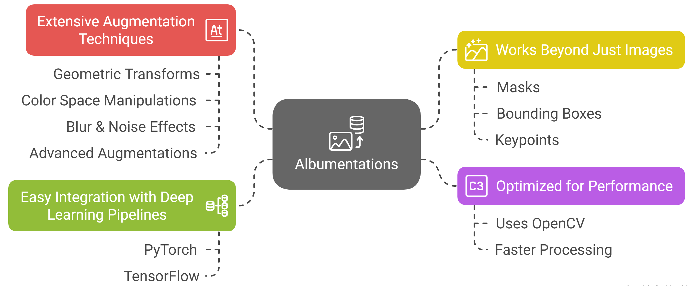
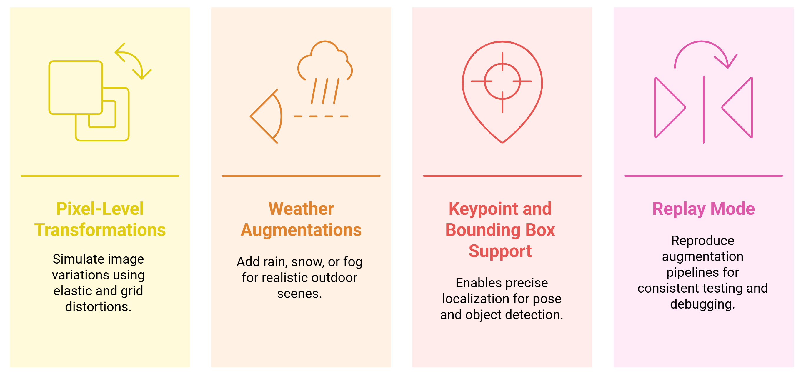

# Enhance Your Computer Vision Models with Albumentations

In the fast-evolving field of computer vision, data quality and diversity are critical for building robust models. This is where Albumentations, a powerful Python library, shines. Designed for fast and flexible image augmentation, Albumentations empowers data scientists and machine learning engineers to enhance their datasets, improve model generalization, and boost performance.
In this article, I’ll dive into what makes Albumentations a go-to tool, its key features, and how you can leverage it for your computer vision projects.

## What is Albumentations?

Albumentations is an open-source Python library optimized for fast and flexible image augmentation. It’s widely used in deep learning tasks like:
- Image classification
- Object detection
- Semantic segmentation

Unlike traditional libraries, Albumentations is performance-optimized (thanks to OpenCV) and supports 70+ transformations, making it ideal for domains like medical imaging, autonomous driving, and facial recognition.

## Key Features of Albumentations



### 1. Extensive Augmentation Techniques

Albumentations supports a wide range of augmentations, including:
- Geometric transforms: Rotate, Flip, Crop, Resize
- Color space manipulations: Hue, Saturation, Brightness, Contrast
- Blur & Noise effects: Gaussian Blur, Motion Blur, RGB Shift
- Advanced augmentations: Cutout, GridDistortion, RandomErasing

### 2. Optimized for Performance

Unlike some libraries that rely on PIL (Python Imaging Library), Albumentations uses OpenCV, making it significantly faster—especially for large datasets.

### 3. Works Beyond Just Images

Many augmentation libraries only transform images, but Albumentations can simultaneously apply the same augmentation to:
- Masks (for segmentation tasks)
- Bounding boxes (for object detection)
- Keypoints (for pose estimation)

This ensures consistency between inputs and labels.

### 4. Easy Integration with Deep Learning Pipelines

Albumentations works smoothly with popular frameworks like PyTorch and TensorFlow. You can easily plug it into your data loader.

## Example: Augmentation Pipeline

Here's how to apply Albumentations to an image (HK..jpg):

### 1. Import Dependencies

```python
import albumentations as A
import cv2
import matplotlib.pyplot as plt
import numpy as np
```

### 2. Load the Image

```python
image_path = "HK.jpg"
image = cv2.imread(image_path)
image = cv2.cvtColor(image, cv2.COLOR_BGR2RGB)
```

### 3. Define All Transformations

```python
transformations = {
    "Original": None,
    "Horizontal Flip": A.Compose([A.HorizontalFlip(p=1.0)]),
    "Rotate (±15°)": A.Compose([A.Rotate(limit=15, p=1.0)]),
    "Brightness & Contrast": A.Compose([A.RandomBrightnessContrast(brightness_limit=0.2, contrast_limit=0.2, p=1.0)]),
    "Hue & Saturation": A.Compose([A.HueSaturationValue(hue_shift_limit=20, sat_shift_limit=30, val_shift_limit=20, p=1.0)]),
    "Motion Blur": A.Compose([A.MotionBlur(blur_limit=7, p=1.0)]),
    "CLAHE (Detail Boost)": A.Compose([A.CLAHE(clip_limit=4.0, tile_grid_size=(8, 8), p=1.0)]),
    "Coarse Dropout": A.Compose([A.CoarseDropout(max_holes=8, max_height=16, max_width=16, p=1.0)]),
    "RGB Shift": A.Compose([A.RGBShift(r_shift_limit=20, g_shift_limit=15, b_shift_limit=15, p=1.0)]),
    "Random Rain": A.Compose([A.RandomRain(drop_length=20, drop_width=1, blur_value=2, brightness_coefficient=0.9, p=1.0)]),
    "Gaussian Noise": A.Compose([A.GaussNoise(var_limit=(10.0, 50.0), p=1.0)]),
    "ISO Noise": A.Compose([A.ISONoise(color_shift=(0.01, 0.05), intensity=(0.1, 0.5), p=1.0)]),
    "Elastic Distortion": A.Compose([A.ElasticTransform(alpha=1, sigma=50, alpha_affine=50, p=1.0)])
}
```

### 4. Function to Display Augmented Images

```python
def display_transformations(image, transforms_dict, cols=3):
    total = len(transforms_dict)
    rows = (total + cols - 1) // cols
    plt.figure(figsize=(5 * cols, 5 * rows))

    for idx, (name, transform) in enumerate(transforms_dict.items()):
        if transform is not None:
            augmented = transform(image=image)
            transformed_img = augmented["image"]
        else:
            transformed_img = image  # original

        plt.subplot(rows, cols, idx + 1)
        plt.imshow(transformed_img)
        plt.title(name)
        plt.axis("off")

    plt.tight_layout()
    plt.show()
```

### 5. Display All Transformations

```python
display_transformations(image, transformations, cols=3)
```

### 6. Output


> **Note:** The example above uses a personal image (HK.jpg) for demonstration, but in real-world ML projects, you'd typically apply these augmentations to domain-specific datasets (e.g., medical scans, satellite imagery, or autonomous driving frames).

## Advanced Features to Explore

Albumentations offers advanced capabilities that cater to specialized use cases:



- Pixel-Level Transformations: Techniques like elastic distortions and grid distortions simulate real-world variations in images.
- Weather Augmentations: Add realistic effects like rain, snow, or fog to prepare models for outdoor environments.
- Keypoint and Bounding Box Support: Perfect for tasks requiring precise localization, such as pose estimation or object detection.
- Replay Mode: Reproduce the same augmentation pipeline across multiple images for consistency in testing or debugging.

Check out the official examples for practical implementations of these features: [Official Examples](https://github.com/albumentations-team/albumentations_examples)

## Final Thoughts

Albumentations is a must-have tool for anyone working in computer vision. Its speed, flexibility, and broad support for different data types make it superior to many alternatives. Whether you’re preprocessing data for a hobby project or a production system, Albumentations can save time and improve results.
